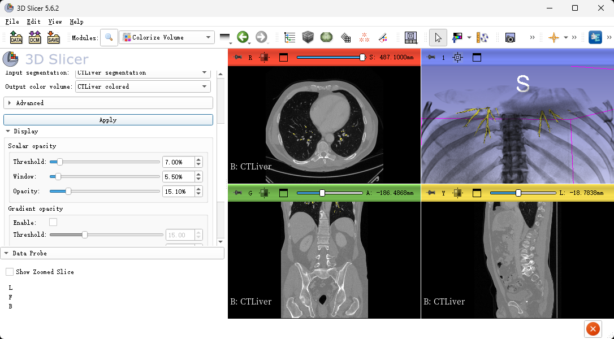

# EvoSeg
Slicer3D segmentation extension

## Usage Steps
1. Start 3D Slicer
2. Go to `EvoSeg` module

3. Select model: `Airway_nnUnet`
4. Select input volume: choose the image that will be segmented. If you do not have images to test with, then click the `Download sample data set...` icon button (next to the model selector) to download a sample data set suitable for the selected model.

5. Click `Apply`
  - When this module is used the first time: The module will download and install a few Python packages and weights for the AI models. This can take 5-10 minutes and several GB disk space. To ensure successful installation, you should pay attention to your network environment..
  - Expected computation time: Running on an inappropriate GPU can take >10 hours.
6. When 'Processing finished.' in Log, to display the segmentation in 3D: click the `Show 3D` button.

7. You Can Edit it in `Segment Editor`

8. For high-quality rendering in 3D:
  - Install `Sandbox` extension
  - Switch to `Colorize volume` module.
  - Click `Apply` to display the segmented image with default settings. Voxel intensities will be set based on the original image, while their color and opacity is determined by the segmentation.
  - Switch to `Lights` module to further optimize appearance in 3D.
  - Click `Select all` button in `Managed 3D views` row (top-right corner).
  - Check `Enable` in `Ambient shadows` section and move the `Size scale` slider until the desired shadow appearance is achieved.

9. Modify Segmentation Result:
  - Select `Target` 
  - Select `Option` checkbutton.
  - Edit `radius` if you want.
  - Click `Segmentation Image` find the places where connections are interrupted
  - Click `Save` button to update Segmentation.
  - Reference image is for demonstration only; we used a large radius circular fill.

## Troubleshooting

### Problem：.
Explanation: .
Solution:
- .

## Contact

Please post any questions to the [Issues](https://github.com/DeepInsightData/EvoSeg/issues).