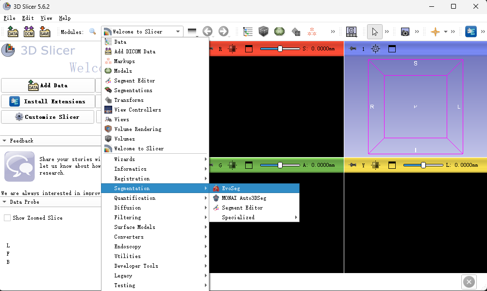
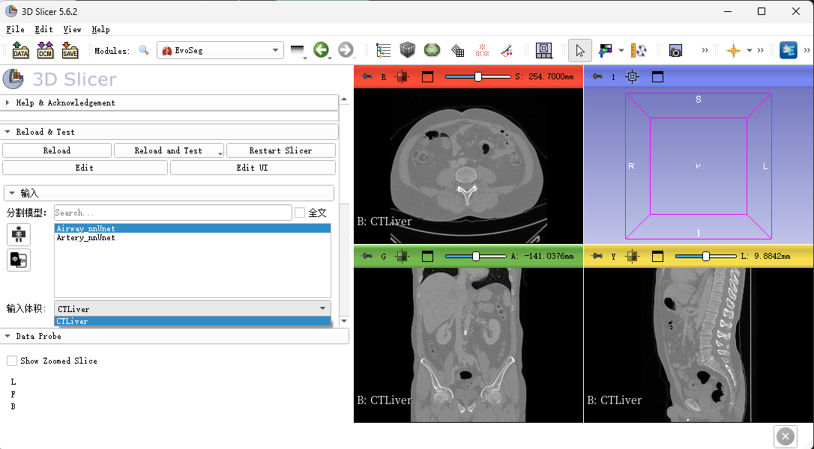
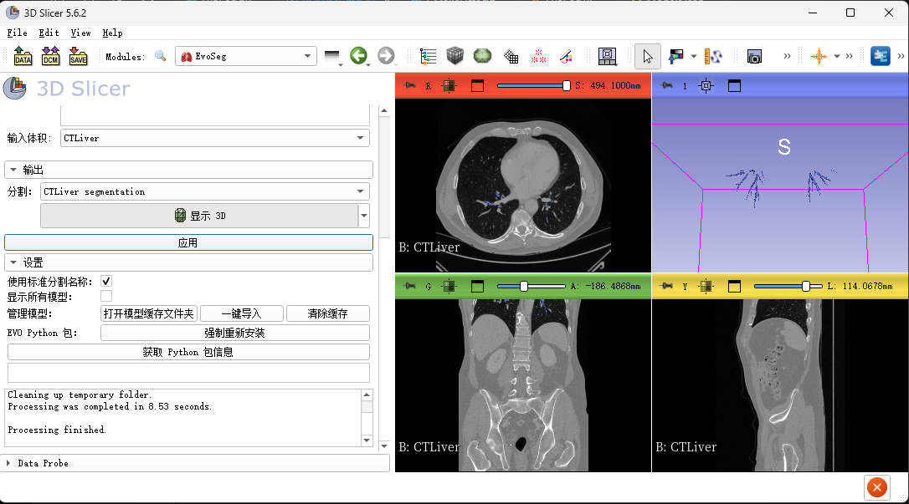

# EvoSeg
Slicer3D segmentation extension

## Usage Steps
1. 启动 3D Slicer
2. 选择 `EvoSeg` 插件

3. 直接点击相应的分割按钮，分别执行相应分割
4. 新的模型输出结果会被随机赋予一个颜色，但Label的名字保持不变

5. 如果要修改模型结果，推荐先导出一份模型输出的原始结果
6. 点击 export mask按钮会依次对已有的模型结果进行选择导出

7. 保存结果之后，您可以放心进行修改，展开结果修改栏，同时在3d视图中会出现一个白色小球

8. 将白色小球推拽到要修改的位置，选择相应的Label，并在要修改的位置鼠标右键点击小球，即可完成一步修改

9. 每一步修改都会自动保存到模型输出结果上，此时要想保存修改后的结果，只需要再次点击export mask按钮 即可

## Troubleshooting

### Problem：.
Explanation: .
Solution:
- .

## Contact

Please post any questions to the [Issues](https://github.com/DeepInsightData/EvoSeg/issues).